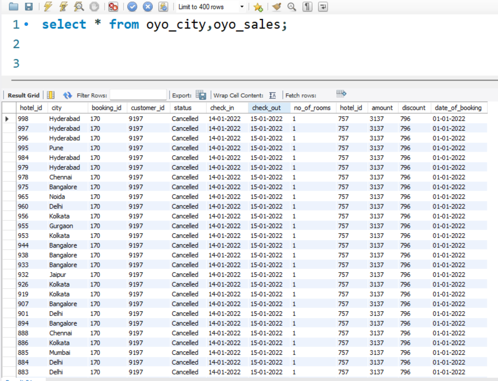
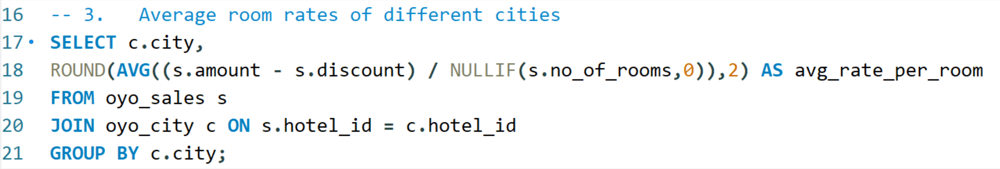
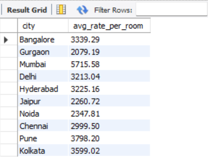

# 📊 OYO Hotel Booking Analysis (SQL Project)

This project is a **SQL-only data analysis** of OYO hotel bookings.  
Using MySQL, I performed end-to-end **Exploratory Data Analysis (EDA)** to understand booking trends, cancellations, revenue, discounts, and customer behavior across different cities.

---

## 🧾 Project Overview

- **Tech Stack:** MySQL, MySQL Workbench, Git & GitHub  
- **Goal:** Strengthen SQL logic building and real-world analytics skills  
- **Focus:**  
  - City-wise bookings  
  - Cancellation patterns  
  - Revenue and discount impact  
  - Customer booking behavior  

---

## 🗂️ Database Structure

### 1️⃣ Table: `oyo_sales`

Booking-level details:

| Column           | Description |
|------------------|-------------|
| booking_id       | Unique booking identifier |
| customer_id      | Unique customer identifier |
| status           | Booking status (Confirmed/Cancelled/etc.) |
| check_in         | Check-in date (dd-mm-yyyy) |
| check_out        | Check-out date (dd-mm-yyyy) |
| no_of_rooms      | Number of rooms booked |
| hotel_id         | Hotel identifier |
| amount           | Total booking amount |
| discount         | Discount applied on booking |
| date_of_booking  | Date when booking was made |

---

### 2️⃣ Table: `oyo_city`

Hotel-to-city mapping:

| Column    | Description |
|-----------|-------------|
| hotel_id  | Hotel identifier |
| city      | City name |

---

## 🎯 Business Questions Answered

1. **Basic EDA** – total booking records, total hotels, total cities  
2. **Number of hotels** in each city  
3. **Average room rate** of different cities  
4. **Cancellation rate** per city  
5. **Number of bookings** of different cities in **Jan, Feb, Mar**  
6. **Total number of bookings** and **average number of rooms per booking**  
7. **Top 5 cities** with the highest number of bookings  
8. **Booking distribution by status**  
9. **Total revenue generated** and **total discount given**  
10. **Average booking amount per city**  
11. **Single vs multiple room bookings**  
12. **Average length of stay** (in days)  
13. **Top 10 customers** by booking count  
14. **Average discount percentage** applied to bookings  

---

## 🛠️ Setup & Usage

### 1️⃣ Clone the repository

```bash
git clone https://github.com/rohannayak360/OYO-Hotel-Booking-Analysis.git
cd OYO-Hotel-Booking-Analysis
````

---

### 2️⃣ Import Database

1. Open **MySQL Workbench**
2. Create a database:

```sql
CREATE DATABASE oyo_db;
USE oyo_db;
```

3. Import the `.sql` file from the repository.

---

### 3️⃣ Run Queries

1. Open the `queries.sql` file from the repo
2. Execute queries to get:

   * City-wise booking stats
   * Cancellation analysis
   * Revenue and discount insights
   * Top customers and top cities

---

## 🔍 Sample SQL Query

**Average Room Rate per City (Net per Room)**

```sql
SELECT c.city,
       ROUND(AVG((s.amount - s.discount) / NULLIF(s.no_of_rooms,0)),2) AS avg_net_rate_per_room
FROM oyo_sales s
JOIN oyo_city c ON s.hotel_id = c.hotel_id
GROUP BY c.city
ORDER BY avg_net_rate_per_room DESC;
```

---

## 📸 Screenshots

### 1️⃣ Database Tables Overview


### 2️⃣ Sample SQL Query Execution


### 3️⃣ Result Output



---

## 📚 Learnings

From this project, I improved:

* Writing SQL queries using `JOIN`, `GROUP BY`, `CASE`, `SUM`, `AVG`
* Using MySQL date functions and conversions
* Calculating business metrics safely using `NULLIF()`
* Translating business problems into SQL logic

---

## 🚀 Future Enhancements

* Build a **Power BI / Tableau dashboard**
* Add more time-based insights
* Perform customer segmentation
* Automate reporting using stored procedures

---

## 👨‍💻 Author

**Rohan Nayak**
Aspiring Data Analyst

🐙 GitHub: [https://github.com/rohannayak360](https://github.com/rohannayak360)
🔗 LinkedIn: *(www.linkedin.com/in/rohannayak360)*
